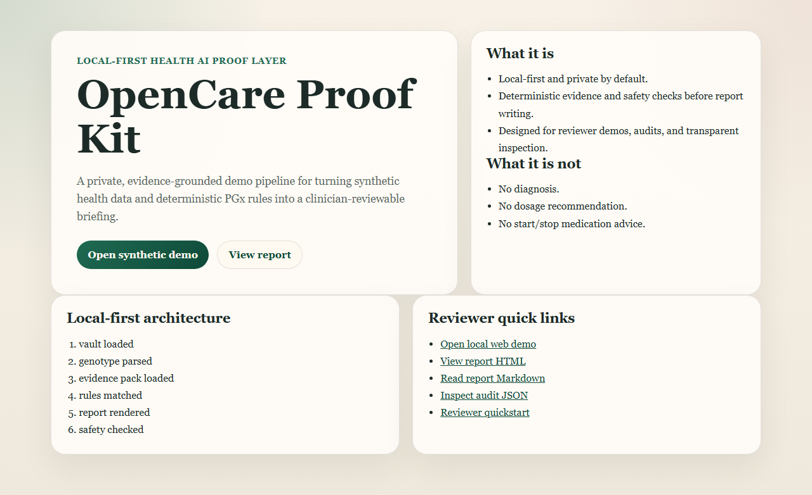
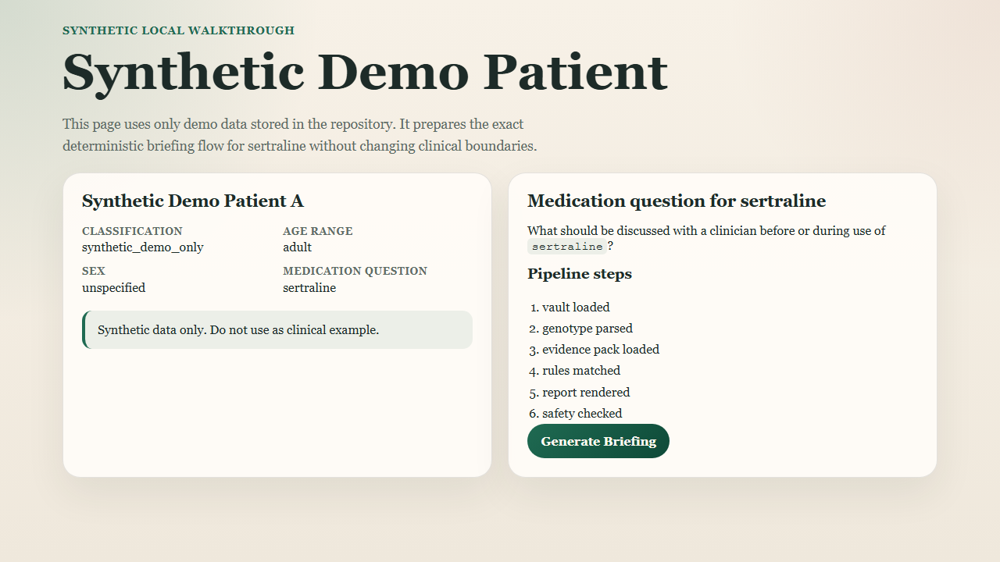
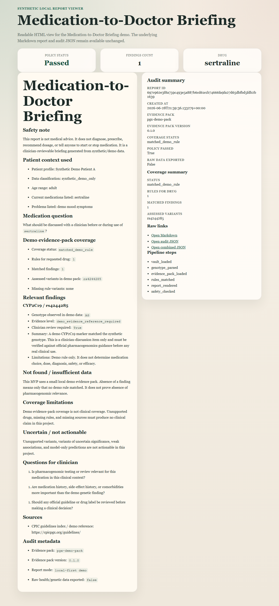
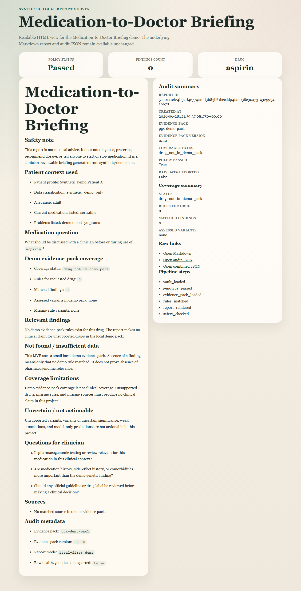

# OpenCare Proof Kit

OpenCare Proof Kit is reusable trust infrastructure for private, inspectable, fail-closed AI agent workflows, with health as the reference stress-test domain.

It provides a local-first proof layer for agent workflows that must be evidence-grounded, policy-checked, auditable, and conservative when data is missing or unsupported.

The implemented reference workflow is Medication-to-Doctor Briefing: a deterministic local pipeline that turns synthetic health vault data, demo genotype-like data, a local evidence pack, safety policy checks, and a report writer into a clinician-reviewable Markdown briefing plus JSON audit trail.

Health is used as the first reference case because it is one of the hardest domains for personal agents: privacy is critical, mistakes are costly, sources matter, and unsupported claims must fail closed.

This project is not an AI doctor, not a diagnostic system, not a medication recommendation engine, and not a generalized cross-domain platform in production.

## Current Status

- Phase: V1F CI/trust metrics hardening.
- Public default branch: `main`.
- Demo data: synthetic/demo-only.
- Runtime model: local-first by default.
- Validation baseline: 79 tests, ruff, mypy, evals runner with 12 passed cases / 0 failed cases, and local trust metrics.

See [docs/project_status.md](docs/project_status.md) for the current capability and validation snapshot.

## Reviewer Links

- [Final submission checklist](docs/final_submission_checklist.md)
- [Grant submission answers](docs/grant_submission_answers.md)
- [Short pitch](docs/grant_short_pitch.md)
- [Milestones](docs/grant_milestones.md)
- [Health/Family Vault demo](docs/health_family_vault_demo.md)
- [Demo video script](docs/demo_video_script.md)
- [Screenshots](docs/screenshots.md)

## Reusable Trust Pattern

```txt
Sensitive context
  -> local data adapter
  -> evidence pack
  -> deterministic rules
  -> safety policy
  -> report/output handoff
  -> audit trail
  -> evals
```

## What It Is

- Open-source infrastructure for trust, evidence, safety, auditability, and evals in sensitive agent workflows.
- A local-first health reference workflow that runs on synthetic/demo data.
- A deterministic tool chain before any report-writing layer.
- A reusable pattern for source-grounded, policy-checked outputs.
- A safety and eval scaffold for catching unsafe medical-advice patterns in the reference domain.
- A grant-reviewable proof kit with docs, release checklist, security policy, and contribution boundaries.

## What It Is Not

- Not medical advice.
- Not diagnosis.
- Not treatment planning.
- Not dosage recommendation.
- Not start/stop medication instruction.
- Not a real-patient data repository.
- Not a FASTQ, BAM, WGS, or clinical genomics pipeline.
- Not SaaS, auth, payments, Telegram, or blockchain.
- Not cloud upload of raw health or genetic data by default.
- Not clinical validation of medication appropriateness.

## Why Local-First

Sensitive agents should not require raw private context to leave the user's environment before the user can inspect what the system does. OpenCare Proof Kit keeps the reference workflow local-first and private-by-default so reviewers can inspect the full path from demo input to generated report without a cloud dependency or hidden data transfer.

The current demo uses only synthetic/demo files in `data/`. Audit metadata records that raw health or genetic data was not exported. The evidence pack is demo-only, and coverage in reports/audits is demo evidence-pack coverage, not clinical coverage.

## Architecture

```txt
Synthetic demo health vault
  -> Demo genotype parser
  -> Local evidence pack loader
  -> Deterministic PGx rule matcher
  -> Demo evidence-pack coverage summary
  -> Markdown report renderer
  -> Safety policy checker
  -> JSON audit builder
  -> Static-text and pipeline-backed eval runner
```

The LLM/report writer is an explanation layer only. It may summarize deterministic findings, limitations, sources, and clinician-review questions. It must not invent sources, diagnose, recommend medication choice, recommend dosage, or override safety policy.

## Quickstart

Install in a Python 3.12 environment:

```bash
python -m venv .venv
source .venv/bin/activate
pip install -e ".[dev]"
```

Windows PowerShell:

```powershell
py -3.12 -m venv .venv
.\.venv\Scripts\python.exe -m pip install -e ".[dev]"
```

Run the core validation:

```bash
pytest
ruff check app tests evals
mypy app evals
python -m evals.runner
python -m evals.trust_metrics
```

Windows PowerShell without activating:

```powershell
.\.venv\Scripts\python.exe -m pytest
.\.venv\Scripts\python.exe -m ruff check app tests evals
.\.venv\Scripts\python.exe -m mypy app evals
.\.venv\Scripts\python.exe -m evals.runner
.\.venv\Scripts\python.exe -m evals.trust_metrics
```

## Trust Checks

GitHub Actions CI runs the portable validation sequence on `push` and
`pull_request`:

- `python -m pytest`
- `python -m ruff check app tests evals`
- `python -m mypy app evals`
- `python -m evals.runner`
- `python -m evals.trust_metrics`

Run local trust metrics:

```bash
python -m evals.trust_metrics
```

The trust metrics report combines eval totals with synthetic/demo Health/Family
Vault artifact safety flags from the committed manifest. These are automated
demo/reviewer trust checks, not clinical validation.

## Demo Commands

Generate a supported-drug demo report and audit:

```bash
python -m app.cli demo-report --drug sertraline --out-dir reports
```

Generate an unsupported-drug safe no-claim report and audit:

```bash
python -m app.cli demo-report --drug aspirin --out-dir reports
```

Expected generated files:

```txt
reports/demo-sertraline-briefing.md
reports/demo-sertraline-audit.json
reports/demo-aspirin-briefing.md
reports/demo-aspirin-audit.json
```

Generated report artifacts are ignored by Git.

## Health/Family Vault Demo

The Health/Family Vault demo exposes deterministic local demo artifacts for the new vault-first layer. It uses a synthetic family vault, a source-preserving read model, and generated JSON/Markdown/manifest files.

Review:

- [Health/Family Vault demo guide](docs/health_family_vault_demo.md)
- [Markdown summary](docs/assets/health_vault/family-vault-summary.md)
- [JSON read-model artifact](docs/assets/health_vault/family-vault-read-model.json)
- [Artifact manifest](docs/assets/health_vault/family-vault-manifest.json)

This layer uses no LLM generation, adds no genetics support, and provides no medical advice.

## Web Demo Routes

Start the API:

```bash
uvicorn app.main:app --reload
```

Open:

```txt
http://127.0.0.1:8000/
http://127.0.0.1:8000/demo
http://127.0.0.1:8000/demo/report-view?drug=sertraline
http://127.0.0.1:8000/demo/report-view?drug=aspirin
http://127.0.0.1:8000/demo/report?drug=sertraline
http://127.0.0.1:8000/demo/report.md?drug=sertraline
http://127.0.0.1:8000/demo/audit?drug=sertraline
```

The local web demo is server-rendered with FastAPI and Jinja2. It is a presentation layer over the same deterministic briefing pipeline used by the CLI and JSON/Markdown API endpoints.

## Visual Demo

Screenshots captured from the local demo:









See [docs/screenshots.md](docs/screenshots.md) for screenshot captions, proof points, and manual recapture instructions. See [docs/demo_video_script.md](docs/demo_video_script.md) for a 90-120 second grant/reviewer demo script.

## Eval Metrics

Run the deterministic eval suite, including real local pipeline cases:

```bash
python -m evals.runner
```

Current validation state:

```txt
total_cases: 12
static_text_cases: 7
pipeline_cases: 5
passed_cases: 12
failed_cases: 0
unsafe_advice_rate: 0.0
missing_source_rate: 0.0
uncertainty_missing_rate: 0.0
audit_missing_rate: 0.0
pipeline_failure_rate: 0.0
```

Static-text evals are guardrails for known unsafe wording patterns. Pipeline evals execute the real local demo pipeline via `build_demo_briefing(...)` and verify report text plus nested audit fields. Neither mode is clinical validation.

## Safety Boundaries

Every generated report must include:

- safety note;
- clinician review note;
- evidence level;
- limitations;
- sources;
- audit metadata;
- demo evidence-pack coverage summary.

The system must not generate:

- diagnosis;
- treatment plan;
- dosage adjustment;
- start/stop medication instruction;
- source-less medical claim;
- actionable claim from VUS or weak/model-only association;
- unsupported-drug clinical claim when the demo pack has no rule;
- hidden uncertainty.

## Repository Map

```txt
app/vault       health vault schemas, loaders, validators
app/genetics    genotype/VCF-like parsing and normalization
app/evidence    evidence pack schema and loading
app/pgx         deterministic medication/genotype rule matching
app/safety      medical safety policy engine
app/ai          report drafting layer
app/reports     Markdown and audit JSON output
evals           static-text and pipeline-backed safety/evidence evals
data            demo-only data and local evidence packs
docs            product, grant, safety, architecture documents
tests           deterministic unit tests
```

## Roadmap

- Phase 2: more evidence-pack tooling and stronger pipeline eval coverage.
- Phase 3: clinician-review workspace and structured export for safer review handoff.
- Phase 4: optional confidential compute adapter after official docs and research review.

The roadmap does not promise real patient diagnosis, medication selection, treatment recommendations, or dosage guidance.

See [docs/roadmap.md](docs/roadmap.md) for the conservative roadmap.

## Grant Alignment

OpenCare Proof Kit is grant-aligned open-source AI infrastructure:

- open-source and inspectable;
- local-first and private-by-default;
- empowering to users and clinicians rather than extractive;
- reusable trust/evidence/safety layer for health AI agents;
- demo workflow grounded in synthetic data, deterministic rules, sources, limitations, and audit metadata.

The grant case is not "another health chatbot." The grant case is reusable infrastructure for making sensitive health-agent workflows inspectable, source-grounded, safety-checked, and locally runnable.

Grant materials are linked near the top of this README for reviewers. Additional background:

- [docs/grant_application_pack.md](docs/grant_application_pack.md)
- [docs/grant_pitch.md](docs/grant_pitch.md)
- [docs/sentient_alignment.md](docs/sentient_alignment.md)

## Contributor And Release Docs

- [CONTRIBUTING.md](CONTRIBUTING.md)
- [SECURITY.md](SECURITY.md)
- [docs/release_checklist.md](docs/release_checklist.md)
- [docs/screenshots.md](docs/screenshots.md)
